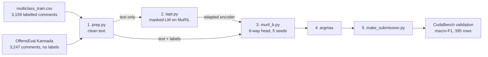

# HASTIKA @ ICON-2026 — Starting Kit

**Hate Speech and Target Category Identification in Kannada-English Code-Mixed Text**

This repository contains the **training-phase** data, submission format, a baseline, and
sample submissions for the HASTIKA shared task. Registration, submission, and the
leaderboards are on CodaBench:

➡️ **CodaBench:** https://www.codabench.org/competitions/17784/

---

## Overview

Social media in India is heavily **code-mixed** — native languages blended with English in a
single utterance. HASTIKA targets hate speech detection in low-resource **Kannada-English
(Kanglish)** text, using **8,058 manually annotated** YouTube comments.

The task has two independent sub-tasks (**separate leaderboards** — you may enter either or both):

- **Task A — Binary Hate Speech Detection:** classify a comment as `Hate` or `Non-Hate`.
- **Task B — Fine-Grained Hate Speech Classification:** classify a **hate** comment into one of
  six target categories: `Gender`, `Political`, `Religion`, `Geo-political`, `Violence`, `Others`.

---

## Data

This repo provides the **training-phase** files (released 20 Aug). Test inputs are released
on 20 Sep; test gold labels are never released — scoring happens on CodaBench.

| File | Rows | Columns | Notes |
|------|------|---------|-------|
| `data/binary_train.csv` | 6,446 | `id, Comment, Label` | Task A training data (with labels) |
| `data/binary_validation_inputs.csv` | 806 | `id, Comment` | Task A validation inputs (**no labels** — predict & submit) |
| `data/multiclass_train.csv` | 3,159 | `id, Comment, Hate Category` | Task B training data (with labels) |
| `data/multiclass_validation_inputs.csv` | 395 | `id, Comment` | Task B validation inputs (**no labels** — predict & submit) |

**Labels**
- Task A `Label`: `Hate` / `Non-Hate`
- Task B `Hate Category`: `Gender`, `Political`, `Religion`, `Geo-political`, `Violence`, `Others`

> Note: keep the `id` column from the provided file **unchanged** in your submission — it is how
> predictions are matched to the gold labels.

---

## Submission format

Submit a single **`predictions.csv`** (zipped) to the matching phase/task on CodaBench.

**Task A — `predictions.csv`**
```
id,label
7417,Non-Hate
958,Hate
```
Accepted label values: `Hate`, `Non-Hate`.

**Task B — `predictions.csv`**
```
id,label
958,Political
4204,Political
```
Accepted label values: `Gender`, `Political`, `Religion`, `Geo-political`, `Violence`, `Others`.

**Rules**
- One row per `id` from the input file.
- Header must be `id,label`.
- Zip **only** `predictions.csv` (no enclosing folder) before uploading. If your tool nests it in a
  folder, that is handled, but a flat zip is safest.
- UTF-8 encoding.

See `starting_kit/` for ready-made sample submissions.

---

## Evaluation

- **Macro-averaged F1** — the **primary ranking metric** (weights every class equally, so rare
  categories such as *Geo-political* count as much as frequent ones).
- **Accuracy** — reported alongside.

Task A is scored over the two binary classes; Task B over the six categories.

---

## Task A Transformer Fine-Tuning

`finetune_task_a.py` fine-tunes a Hugging Face sequence-classification model for
binary hate-speech detection. It creates a stratified validation split from
`data/binary_train.csv`, selects the checkpoint with the best validation macro-F1,
and saves the model and tokenizer. The supplied
`data/binary_validation_inputs.csv` file has no labels, so it is not used for
early stopping or hyperparameter tuning.

For a copy-paste walkthrough from environment setup through CodaBench submission,
see [`TASK_A_GUIDE.md`](TASK_A_GUIDE.md).

### Installation

The project uses [uv](https://docs.astral.sh/uv/) for Python, virtual-environment,
and dependency management. Choose one PyTorch accelerator extra and run it from
the repository root. CUDA 12.8 is the recommended starting point for an NVIDIA
GPU:

```bash
# NVIDIA GPU using CUDA 12.8
uv sync --extra cu128

# Alternatives: newer CUDA 13.0 or CPU-only
uv sync --extra cu130
uv sync --extra cpu
```

`uv` reads `pyproject.toml` and `uv.lock`, creates `.venv`, installs the locked
dependencies, and uses the Python version in `.python-version`. You do not need
to activate the environment when commands are launched with `uv run`. Use the
same accelerator extra for `uv sync` and every `uv run` command.

Before training, confirm that PyTorch can see your GPU:

```bash
uv run --extra cu128 python -c "import torch; print(torch.cuda.is_available(), torch.cuda.get_device_name(0) if torch.cuda.is_available() else 'CPU')"
```

### Train with MuRIL

MuRIL is the default model and is a good first choice for Kannada-English text.
The command below enables FP16 mixed precision on a supported NVIDIA GPU.

```bash
uv run --extra cu128 python finetune_task_a.py \
  --model google/muril-base-cased \
  --output-dir checkpoints/muril_task_a \
  --fp16
```

### Train with XLM-R

```bash
uv run --extra cu128 python finetune_task_a.py \
  --model xlm-roberta-base \
  --output-dir checkpoints/xlmr_task_a \
  --fp16
```

### Train a separate demojized MuRIL model

This experiment converts emoji into English descriptions before tokenization and
saves its best checkpoint separately from the original-text model:

```bash
uv run --extra cu128 python finetune_task_a_demojized.py \
  --model google/muril-base-cased \
  --output-dir checkpoints/muril_task_a_demojized \
  --fp16
```

Use the same seed and hyperparameters as the original run for a fair macro-F1
comparison. The saved `training_metadata.json` records `"demojized": true`.

The first run downloads the selected model from Hugging Face. Training progress
reports loss, macro-F1, and accuracy for each epoch. The best model is written to
the selected output directory, together with `training_metadata.json`.

### Generate Task A predictions

After training, load the saved checkpoint and generate predictions for the
unlabeled Task A validation inputs:

```bash
uv run --extra cu128 python predict_task_a.py \
  --model-dir checkpoints/muril_task_a \
  --input-csv data/binary_validation_inputs.csv \
  --output predictions.csv \
  --fp16
```

The script automatically reuses the training run's text-cleaning setting and
emoji mode, as well as its maximum sequence length, from
`training_metadata.json`. It preserves every input ID and writes the required
`id,label` columns. Check the row count and label distribution printed at the
end, then create the upload archive:

```bash
zip task_a_predictions.zip predictions.csv
```

Upload `task_a_predictions.zip` to the matching Task A phase on CodaBench.

### Useful options

```bash
# Reduce GPU memory use
--batch-size 8

# Change sequence length
--max-length 128

# Try balanced loss weighting
--class-weight balanced

# Use the original comments without HTML/encoding cleanup
--raw-text

# Reproduce a different training split/seed
--seed 123
```

For a reliable comparison, train MuRIL and XLM-R with the same seed and settings,
then repeat the best configuration with several seeds. The competition’s primary
metric is macro-F1, so use it—not accuracy—to choose checkpoints.


## Task B Fine-Grained Classification

Task B is the six-way target category over hate comments, scored on macro-F1. This
section is the summary: the pipeline, everything that has been tried and what it
scored, and the plan from here.

| for | see |
|---|---|
| copy-paste commands | [`work/RUN_TASK_B.md`](work/RUN_TASK_B.md) |
| which Kaggle notebook does what | [`work/NOTEBOOKS.md`](work/NOTEBOOKS.md) |
| every run's numbers | [`TRAINING_RESULTS.md`](TRAINING_RESULTS.md) |
| what was uploaded to CodaBench | [`submissions/`](submissions/) |

### Pipeline



| stage | script | what it does |
|---|---|---|
| 1. clean | `work/prep.py` | The released CSVs are mojibake (UTF-8 decoded as latin-1). Repairs that, unescapes HTML, strips `<br>`, normalizes URLs and @mentions, turns emoji into English words. |
| 2. adapt | `work/tapt.py` | Task-adaptive pretraining: 8 epochs of masked-LM over the Task B training comments and the OffensEval-Dravidian Kannada corpus, before any classifier exists. Reads no labels. Refuses Task A's files and the validation inputs, because 319 of the 395 Task B validation comments also sit in `binary_train.csv`. |
| 3. fine-tune | `work/muril_b.py` on `work/muril.py` | Six-way head with mean+max pooling, layer-wise LR decay, the top two layers re-initialized, FGM adversarial training, EMA, balanced class weights, label smoothing 0.05, 192 tokens, 6 epochs. Seeds average their probabilities. |
| 4. decode | `work/muril_b.py` | Plain argmax. A decode tuned for macro-F1 lost on every run. |
| 5. package | `work/make_submission.py` | Checks `id,label` against the input ids and writes the flat zip CodaBench expects. |

From the grid onward this configuration is called **`D0_V0_noaux`**: corpus D0 (Kannada
text only), vocab V0 (MuRIL's tokenizer unchanged), no auxiliary head. It is the same
recipe as `b_tapt` and `f_tapt` in the earlier runs.

### What has been run

| # | date | notebook | question | classifier trained on | outcome |
|---|---|---|---|---|---|
| 1 | 12 Sep | `kaggle_task_b.ipynb` | which encoder and loss? Ideas ranked on a 15% holdout, the top four on five folds | 85% (holdout) or 80% per fold | TAPT MuRIL was the only arm above the floor, 0.6013 OOF. Submitted as `b_tapt_5f`: **0.5922** on CodaBench |
| 2 | 13 Sep | `kaggle_fullfit_sweep.ipynb` | the same ideas on every deduplicated row | 3,143 rows, 5 seeds | no local score by construction. `f_tapt` submitted: **0.6007** on CodaBench¹ |
| 3 | 13-14 Sep | `kaggle_grid.ipynb` | does more TAPT text, a bigger vocabulary or an auxiliary head help? | 85% | none did. `D0_V0_noaux` stayed on top at 0.5972 |
| 4 | next | `kaggle_d0v0_noaux_full.ipynb` | `D0_V0_noaux` on 100% of the data | 3,159 of 3,159 rows, 5 seeds; TAPT on 6,406 of 6,406 comments | not run yet. Scored on CodaBench only |

¹ Inferred, not confirmed: the `scoring_result.zip` reading 0.6007 was downloaded a few
minutes after `f_tapt.zip`. Check the CodaBench submission list.

### Results

**CodaBench validation phase**, 395 rows with hidden gold labels:

| submission | recipe | macro-F1 |
|---|---|---|
| `f_tapt` | TAPT MuRIL, 5 seeds on all 3,143 deduplicated rows | 0.6007¹ |
| `b_tapt_5f` | TAPT MuRIL, the five fold models averaged | 0.5922 |

**Local, five folds over 3,143 rows**, out-of-fold:

| run | macro-F1 |
|---|---|
| TAPT MuRIL (`b_tapt_5f`) | **0.6013** |
| weight-searched blend, nested estimate | 0.6002 |
| TF-IDF + LinearSVC floor | 0.5948 |
| stock MuRIL | 0.5727 |
| R-Drop 0.5 | 0.5614 |
| focal loss, gamma 2 | 0.5572 |

Every local figure is the unbiased `last`-checkpoint number. `best` picks each fold's
checkpoint by macro-F1 on the rows it then reports, which flatters the run, so both are
always printed and only `last` is compared.

TAPT's +2.9 points over stock MuRIL on identical folds is the one gain that clears the
noise.

### What has been tried and did not help

| idea | best measurement | verdict |
|---|---|---|
| XLM-R base | 0.5561, holdout | below MuRIL. The text is romanized Kannada: 91% of comments contain no English function word |
| HingRoBERTa | 0.5678, holdout | below MuRIL |
| abusive-speech MuRIL as a warm start | 0.5718, holdout | below stock MuRIL |
| mDeBERTa | 0.1002, holdout | collapsed; 3e-5 is too high for it |
| MuRIL-large | none | cut by the budget guard before it scored |
| focal loss | 0.5572, 5-fold | below stock MuRIL |
| R-Drop | 0.5614, 5-fold | below stock MuRIL |
| blending every 5-fold run with the floor | 0.6002, nested | below the best single model |
| per-class decode weights for macro-F1 | -0.009, nested | lost on every run |
| gazetteer, mood and address tags | -0.007 on the floor | noise |
| spelling normalization, OOV resolver, conjunction features | +0.002, +0.003, -0.003 | noise |
| back-transliteration to Kannada script | none | rejected, see `work/SETUP.md` |
| grid: Tamil and Malayalam text added to TAPT (D1) | 0.5865 against 0.5972 | no gain |
| grid: vocabulary extended with frequent word-forms (V1) | 0.5071 to 0.5656 | **hurts**, 3 to 8 points below the same cell with V0 |
| grid: auxiliary violent-act head | 0.5916 against 0.5972 | no gain, and -4.5 points on stock MuRIL |

How to read the grid. The macro-F1 of a 472-row holdout has a bootstrap standard
deviation of 2.7 points, so the top seven cells, which span 1.5 points, are one result.
Only the vocabulary extension is a real effect, and it is negative. Three-seed averages
scored below seed 42 alone for both stock MuRIL (0.5820) and TAPT (0.5917), which says
seed 42 was a lucky draw rather than that averaging hurts. The TAPT cells had also read
the holdout comments' text, though not their labels, which tilts the grid toward TAPT.
The case for TAPT rests on the five-fold comparison above, not on the grid.

### The open problem

Macro-F1 charges a sixth of the score per class regardless of support, and the
two weakest classes are where the remaining points are:

| class | rows | recall | largest error |
|---|---|---|---|
| `Violence` | 221 | 0.29 | 29% go to `Gender` |
| `Others` | 447 | 0.40 | 45% go to `Gender` |

The cause is lexical. Gendered slurs are the ambient register of this corpus and
appear across every category, while the label follows the **target** of the
comment. A row carrying a gendered slur but aimed at a language group is
`Geo-political`; the surface cue and the label disagree. Measured by
over-representation against base rate, four classes have clean target markers
(`pakistan` 11.3x, `hijab` 7.9x, `speaker` 5.7x, `btv` 3.9x) while `Violence`
has none: its best marker covers 8 of its 221 rows. Task B is target
identification wearing a slur-detection costume.

### Plan: no holdout, scored on CodaBench

The architecture is settled at `D0_V0_noaux`. Holdout and fold runs were how it was
chosen, and each one withheld 15-20% of the 3,159 labelled rows to buy a local score
that is no steadier than CodaBench's: 2.7 points of standard deviation on the 472-row
holdout against 3.0 on the 395 validation rows. From here, every Task B run:

1. **Holds nothing back.** TAPT runs with `--val-frac 0 --min-words 1 --no-dedupe`, so
   all 6,406 comments. The classifier runs with `--folds 1 --no-dedupe`, so all 3,159
   rows, with five seeds averaged.
2. **Is scored directly on the CodaBench validation phase.** The macro-F1 CodaBench
   returns is the run's only score. A full fit has no local number and none should be
   reported for it.
3. **Is recorded.** The zip, `predictions.csv`, `test_probs.npy` and the CodaBench score
   go in `submissions/<tag>/`, with a row in `TRAINING_RESULTS.md`.
4. **Is read against the noise.** One CodaBench score carries about 3 points of standard
   deviation, so a smaller gap between two submissions is not a reason to change the
   recipe. Check the phase's submission cap before spending submissions on comparisons.

Next steps, in order:

- **Run `work/kaggle_d0v0_noaux_full.ipynb`**, about two hours on a T4, and submit
  `d0v0_noaux_full.zip`. It checks its own logs and stops unless TAPT used 6,406 comments
  and every seed trained on 3,159 rows. Compare it with 0.5922 and 0.6007.
- **Average more seeds.** Each full run keeps its 395 x 6 probability matrix, so the
  probabilities from several runs can be averaged without any retraining.
- **Prepare the test phase.** Test inputs are released on 20 Sep and the deadline is
  1 Oct. `muril_b.py` predicts `data/multiclass_validation_inputs.csv` by a hard-coded
  path and does not save classifier weights, so the test file has to be wired in and the
  notebook rerun for the final submission.

### Running it

```bash
# the current recipe on every row: D0_V0_noaux, five seeds, no holdout
python -u work/tapt.py --model google/muril-base-cased \
    --corpus data/multiclass_train.csv data/external/offenseval_kn.csv --epochs 8 \
    --val-frac 0 --min-words 1 --no-dedupe --out work/runs/tapt-d0v0-100
python -u work/muril_b.py --tag b_d0v0_noaux_full --model work/runs/tapt-d0v0-100 \
    --folds 1 --no-dedupe --aux-weight 0 --seeds 42 43 44 45 46 --epochs 6
python work/make_submission.py --task b \
    --pred work/runs/b_d0v0_noaux_full/predictions.csv --out d0v0_noaux_full.zip
```

On Kaggle, upload `work/kaggle_d0v0_noaux_full.ipynb` alone and Save & Run All; it
clones `task-b` itself.

---

## Important dates

| Date | Milestone |
|------|-----------|
| 25 Aug | Training data released (this repo) |
| 20 Sep | Test inputs released |
| 01 Oct | Final submission deadline |
| 04 Oct | Results & rankings |
| 25 Oct | System paper deadline |
| 10 Dec | Camera-ready working notes |

*Tentative; deadlines 23:59 AoE unless noted. See CodaBench for the authoritative schedule.*

---

## Citation

If you use this data or take part, please cite the HASTIKA dataset paper

@article{kavatagi2025hastika,
  title={HASTIKA: hate speech and target identification in Kannada-English code-mixed text: S. Kavatagi, R. Rachh},
  author={Kavatagi, Sanjana and Rachh, Rashmi},
  journal={Language Resources and Evaluation},
  volume={59},
  number={3},
  pages={2811--2856},
  year={2025},
  publisher={Springer}
} 
and the shared task overview paper.

## Contact

shankar.biradar@manipal.edu · sanjana.kavatagi@manipal.edu
